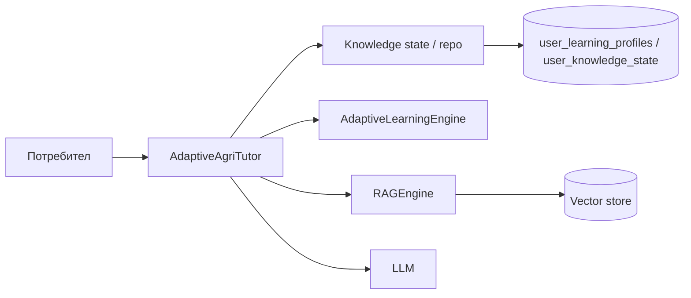

# Adaptive Learning (AI Agri Academy)

Практичен слой върху съществуващия RAG и LLM: **профил + mastery по тема → трудност → филтриран retrieval → урок**; квизът връща feedback и обновява `mastery_level`.

## Архитектура (обзор)

## База (Supabase / Postgres)

Миграция: `apps/backend/migrations/005_user_adaptive_learning.sql`

- `user_learning_profiles` — `user_id` (text PK), `overall_level`, `cultures` (jsonb), `region`, `last_activity`
- `user_knowledge_state` — уникален `(user_id, topic)`, `mastery_level`, `attempts`, `correct_answers`

RLS е включен; клиент с JWT вижда само собствените редове (`user_id = auth.uid()::text`). Backend с **service_role** ключ обикновено заобикаля RLS.

## Backend модули

| Път | Роля |
|-----|------|
| `ai/adaptive/engine.py` | Ниво 1–5, `get_next_difficulty`, `generate_personalized_path` |
| `ai/adaptive/quiz.py` | `calculate_score`, `bump_mastery`, съобщения за прогрес |
| `ai/adaptive/repository.py` | Supabase или `InMemoryLearningRepository` (+ delete / update by id / sorted / weak) |
| `ai/adaptive/knowledge_service.py` | `KnowledgeService` — CRUD над същия repo |
| `ai/tutors/adaptive_tutor.py` | `AdaptiveAgriTutor.teach` / `assess_knowledge` / `get_progress` |
| `app/tutor/ab_assign.py` | Стабилно A/B разпределение по `user_id` |

RAG филтър: `build_agri_vector_metadata_filter(culture=…, region=…, difficulty=…)`.

## API (FastAPI) — основни маршрути

Пълният префикс от приложението е **`/api/tutor/...`**.

| Метод | Път | Описание |
|--------|-----|----------|
| `POST` | `/api/tutor/teach` | Урок по **тема**: `user_id`, `topic`, `tutor_mode` = `auto` \| `adaptive` \| `static`, опционално `culture` / `cultures` / `region` / `experience` / … Отговорът включва **`variant`** (`adaptive` \| `static`), **`ab_test_active`** при A/B. |
| `POST` | `/api/tutor/assess` | Квиз: `user_id`, `topic`, `answers` ([] boolean). **`record_mastery`**: `true` (запис при adaptive) / `false` (само preview след static). |
| `GET` | `/api/tutor/progress?user_id=` | Профил + списък теми + **`computed_level`** за dashboard. |

Legacy (същата логика през `run_tutor_teach` / `run_tutor_assess`):

- `POST /api/tutor/adaptive/lesson` — форсира `tutor_mode=adaptive`
- `POST /api/tutor/adaptive/assess`

### Feature flags и A/B

- **`tutor.adaptive`** — `FEATURE_TUTOR_ADAPTIVE=true` (Unleash: `tutor_adaptive`). Adaptive клонът на `/teach` и записът в `/assess`.
- **`tutor.chat`** — нужен за **static** клона (обвива `tutor_router.tutor_chat` с фиксиран prompt по тема).
- **`tutor.ab_test`** — `FEATURE_TUTOR_AB_TEST=true` (Unleash: `tutor_ab_test`). При **`tutor_mode=auto`** използва се стабилен hash по `user_id` и **`TUTOR_AB_ADAPTIVE_WEIGHT`** (0–100, по подразбиране 50) — дял за adaptive.

По подразбиране adaptive е **изключен** (`FEATURE_TUTOR_ADAPTIVE=false`).

## Next.js (web)

Проксита към FastAPI (същият `API_URL` като за `/api/tutor/chat`):

- `POST /api/tutor/teach`
- `POST /api/tutor/assess`
- `GET /api/tutor/progress?user_id=`

UI: страница **`/tutor`** — раздел **«Урок по тема»** (A/B badge), **Progress dashboard**; събитие `tutor-progress-refresh` след успешна оценка.

## `user_knowledge_state` — CRUD

### SQL

- **`migrations/006_user_knowledge_state_crud.sql`** — `updated_at`, trigger при `UPDATE`, индекси по `user_id`, `topic`, `mastery_level`.
- Основната дефиниция остава в **005** (`user_id` **text** + FK към `user_learning_profiles` за demo/произволни id).

### Код

| Път | Роля |
|-----|------|
| `app/models/knowledge.py` | `UserKnowledgeState`, `KnowledgeUpdate` |
| `ai/adaptive/knowledge_service.py` | `KnowledgeService`, `get_knowledge_service()` |
| `app/api/tutor_knowledge_state.py` | HTTP CRUD (изисква `tutor.adaptive`) |

### HTTP (`/api/tutor/...`, `FEATURE_TUTOR_ADAPTIVE=true`)

| Метод | Път |
|--------|-----|
| `GET` | `/knowledge-state?user_id=` (+ опционално `weak_only`, `threshold`) |
| `GET` | `/knowledge-state/item?user_id=&topic=` |
| `GET` | `/knowledge-state/{record_id}` |
| `POST` | `/knowledge-state` |
| `PATCH` | `/knowledge-state/{record_id}` |
| `DELETE` | `/knowledge-state?user_id=&topic=` |
| `POST` | `/knowledge-state/increment-attempt` |

Виж **`docs/QUIZ-SYSTEM.md`** — квиз генерация: `/api/quiz/generate`, `/api/quiz/submit` (Next прокси: `/api/quiz/generate`, `/api/quiz/submit` в `apps/web`).
