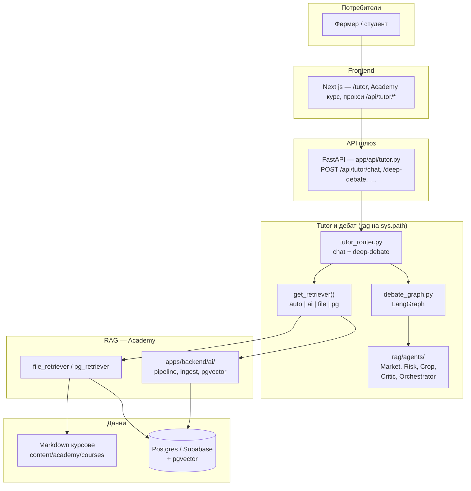

# AI архитектура — AgriNexus (визия и карта на кода)

Документът описва **принципите**, **high-level потока**, **препоръчителна папкова структура** (като цел) и **реалното състояние** в репозитория, плюс **ключови компоненти**. За оперативни env и ingest: [`AI_MODULE.md`](./AI_MODULE.md). За production LLM / embeddings / Supabase / памет: [`AI-PRODUCTION-STACK.md`](./AI-PRODUCTION-STACK.md). За **multi-agent patterns** (иерархичен, sequential, parallel, tools, feedback): [`MULTI-AGENT-COLLABORATION.md`](./MULTI-AGENT-COLLABORATION.md).

---

## 1. Обща визия

Целта е **модулна**, **разширяема** и **explainable** AI система, която комбинира:

| Поток | Описание |
|--------|----------|
| **Образователен AI Tutor** | Отговори с опора от Academy материали (RAG), ясни източници. |
| **Практически агенти** | Специализирани гледни точки (пазар, риск, култури, почва…), подходящи за реални решения на фермата. |
| **Multi-Agent Debate** | За важни стратегически въпроси: последователни мнения, критик, синтез от оркестратор. |

### Основен принцип: Academy-First + Practical Agent System

1. **Първо учене** — потребителят има достъп до структурирано Academy съдържание; RAG гарантира проследимост към източници.  
2. **После практика** — Tutor и агентите дават персонализирани съвети в контекст на култура, регион, профил.  
3. **При висока несигурност** — Deep Debate обединява мнения и критика преди финална препоръка.

Explainability се постига чрез: **източници от RAG**, **разделени роли на агентите**, **визуализация на дебата** във frontend.

---

## 2. High-level архитектура (Mermaid)

По-долу е **опростена** диаграма, съвместима с Mermaid в GitHub / VS Code / Cursor (без вградени SVG стилове от външен експорт).



**Поток Deep Debate (логически):** еднократно зареждане на RAG контекст и източници → специалисти (с `rag_context` в промптите) → критик (с опора от Academy) → оркестратор (синтез + източници) → отговор и `sources` към UI. **Много-рундов дебат** (същият RAG + LangGraph цикъл): `apps/backend/ai/debate/` и `POST /api/debate/run` — виж [`MULTI-AGENT-COLLABORATION.md`](./MULTI-AGENT-COLLABORATION.md).

---

## 3. Препоръчителна папкова структура и съпоставка с проекта

### 3.1 Целева модулна подредба (идеал)

Това е **ориентир** за бъдещ рефактор, не задължително еднакво с днешния монорепо.

```text
apps/backend/
├── app/                         # FastAPI приложение (gateway, конфиг, auth)
│   └── api/
│       └── tutor.py             # Стабилни /api/tutor/* маршрути
├── ai/                          # RAG ядро: embeddings, vector store, ingest, pipeline
│   ├── core/                    # (опционално) orchestrator, общи абстракции
│   ├── agents/                  # (опционално) ако се изнесат от rag/
│   ├── prompts/
│   ├── tools/
│   ├── memory/
│   └── evaluation/
├── rag/                         # Legacy / LangChain / subgraphs, retriever factory
│   ├── loaders/                 # Markdown loaders (частично в ai/markdown_loader.py)
│   └── …
└── …
```

### 3.2 Текущо състояние в репозитория (къде е каквото)

| Целеви елемент | Реален път / бележка |
|----------------|----------------------|
| API gateway | `apps/backend/app/api/tutor.py` → lazy import от `rag/tutor_router.py` |
| Tutor chat + RAG | `rag/tutor_router.py` + `rag/retriever.py` |
| Deep Debate граф (един проход) | `rag/debate_graph.py` (LangGraph) |
| Multi-round дебат | `apps/backend/ai/debate/` + `app/api/debate.py` → `POST /api/debate/run` |
| ReAct tool-calling агент | `apps/backend/ai/agents/react/` + `ai/tools/rag_tool.py` + `app/api/react_agent.py` → `POST /api/react/run` |
| Агенти (Base, Market, Risk, Crop, Critic, Orchestrator) | `apps/backend/rag/agents/*.py` |
| Промпти | `apps/backend/rag/prompts.py` |
| LLM инстанция | `apps/backend/rag/core/llm.py` |
| RAG ingest / pgvector / Supabase vector | `apps/backend/ai/` (`pipeline.py`, `ingest.py`, …), `ai/vector_store/`, `scripts/ingest_academy.py`, `rag/retriever.py` |
| Зареждане на Markdown курсове | `apps/backend/ai/markdown_loader.py` + `content/academy/courses/` |
| Стари subgraph-и (LangGraph) | `apps/backend/rag/subgraphs/*` |
| Минимален LangGraph tutor (отделен от rag) | `apps/backend/app/tutor/minimal_graph.py` |
| Frontend + прокси | `apps/web/src/app/api/tutor/chat`, `deep-debate`; UI: `tutor/page.tsx`, `AnimatedDebateTimeline.tsx`, `academy-rag-debate-panel.tsx` |

**Практическа препоръка:** нов код за **Academy RAG и ingest** да остава под `ai/`; **дебат и специализирани агенти**, тясно свързани с `tutor_router`, засега под `rag/agents/`. При по-голям рефактор може да се премести `debate_graph` + `agents` под `ai/core/` или отделен пакет `agrinexus_ai`, без да се чупят импортите на `path_setup`.

---

## 4. Ключови компоненти

### 4.1 Образователен Tutor

- **Вход:** въпрос, опционално `culture` / `region` (филтри към RAG).  
- **RAG:** `get_retriever().get_context()` — векторно търсене и/или TF–IDF върху Academy Markdown.  
- **Изход:** текстов отговор + `sources` за UI.  
- **Файлове:** `rag/tutor_router.py`, `rag/retriever.py`, `ai/pipeline.py` (режим `ai`).

### 4.2 Практически агенти (в дебат)

- **Market, Risk, Crop** — наследяват `SpecialistAgent`; подават се шаблони от `prompts.py` и **споделен Academy контекст** (`rag_context`).  
- **Soil & Nutrition** — дефиниран е промпт в `prompts.py`; при нужда лесно се добавя нов клас агент по същия модел.  
- **Файлове:** `rag/agents/specialists.py`, `rag/agents/base.py`.

### 4.2b ReAct агент с инструменти

- **LangGraph** `create_react_agent`: време, пазар (опционално), Academy RAG чрез **`ai/tools/rag_tool.py`** — по подразбиране `RAGEngine` + `similarity_search`, при нужда fallback към `rag.retriever` (`REACT_RAG_MODE`).  
- **API:** `POST /api/react/run`, feature flag `tutor.react_tools`.  
- **Файлове:** `ai/agents/react/*`, `ai/tools/rag_tool.py`, `app/api/react_agent.py`.

### 4.3 Critic и Orchestrator

- **Critic** — сравнява мненията, търси противоречия, оценява риск и съгласуваност с **опората от Academy**.  
- **Orchestrator** — финален синтез, баланс, actionable стъпки, раздел за източници.  
- **Файлове:** `rag/agents/critic.py`, `rag/agents/orchestrator.py`.

### 4.4 RAG Engine

- **Retrieval factory:** `ACADEMY_RAG_BACKEND` (`auto` | `ai` | `file` | `pg`).  
- **LangChain vector store (Supabase):** `ai/vector_store/` (`VectorStoreService`, `VectorStoreConfig`); `RAGEngine` при `RAG_VECTOR_BACKEND=supabase` го ползва за връзка/ingest.  
- **Ingest:** `python -m ai` от `apps/backend`; за Supabase таблица `documents` + `python scripts/ingest_academy.py` (опционално `--rebuild`).  
- **Схема:** `migrations/002_ai_course_chunks.sql` (ai pipeline); `migrations/003_supabase_vector_documents.sql` (LangChain Supabase RAG).  
- **Файлове:** `ai/*`, `ai/vector_store/*`, `scripts/ingest_academy.py`, `rag/retriever.py`, `rag/file_retriever.py`, `rag/pg_retriever.py`.

### 4.5 Explainability в UI

- Списък **Academy източници** при обикновен chat и при Deep Debate.  
- **Визуализация на потока** (RAG → агенти → критик → синтез) в `AnimatedDebateTimeline`.

### 4.6 Бъдещи модули (още няма отделни пакети)

| Модул | Назначение |
|--------|------------|
| `tools/` | Външни API: време, пазарни цени, сателит — извиквани от агенти или orchestrator. |
| `memory/` | Персистентна история, предпочитания по стопанство (съгласувано с privacy). |
| `evaluation/` | RAGAS / human eval — частично наследство: `rag/evaluate_rag.py`, `rag/run_evaluation.py`. |

---

## 5. Връзка с дизайн системата

UI за Tutor и дебат следва токените и компонентните навици от [`DESIGN-SYSTEM.md`](./DESIGN-SYSTEM.md) (цветове, типография, тъмен режим), за да е визуално съгласуван с останалата част на продукта.

---

## 6. Резюме

- **Academy-First:** RAG преди или вътре в агентските стъпки; източниците се връщат към клиента.  
- **Practical agents:** модулни класове + общ `BaseAgent` договор.  
- **Debate:** LangGraph + Critic + Orchestrator за тежки решения.  
- **Код:** постепенно сближаване с целевата структура от §3.1, без голям „big bang“ рефактор.

При промени в API поддържай синхрон между `app/api/tutor.py`, `rag/tutor_router.py` и Next.js прокситата под `apps/web/src/app/api/tutor/`.
