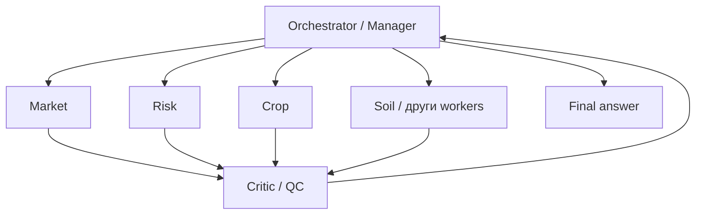
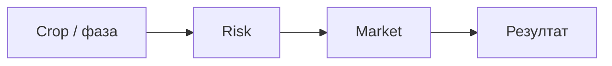
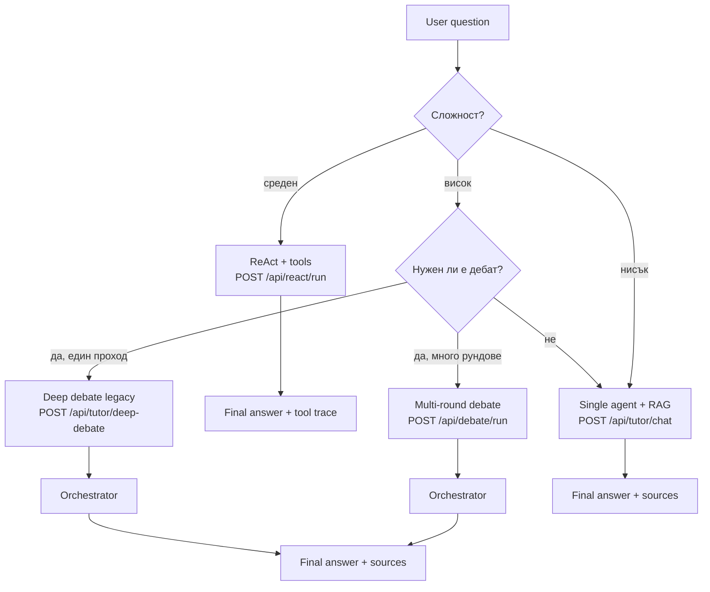

# Multi-Agent collaboration patterns — AI Agri Academy

Кратък справочник за **сътрудничество между агенти** в земеделски AI: кога какъв pattern, плюс **съпоставка с кода** в AgriNexus. За обща архитектура виж още [`AI-ARCHITECTURE.md`](./AI-ARCHITECTURE.md) и [`AI_MODULE.md`](./AI_MODULE.md).

---

## 1. Hierarchical collaboration (най-универсален)

**Идея:** мениджър (orchestrator) задава подзадачи на специалисти; отделен слой за **качество** (critic / review) преди финал.

**Кога:** общи въпроси, комплексни решения (пазар + климат + агротехника в един отговор).

**В проекта:** логически съвпада с **Deep Debate** — специалисти → критик → оркестратор (`rag/debate_graph.py`, `rag/agents/*`). Много-рундов вариант: `ai/debate/graph.py` + `POST /api/debate/run`.

---

## 2. Multi-round debate (фиксирани или динамични рундове)

**Идея:** няколко цикъла *мнения → критика → преглед*, за да излязат противоречията на повърхността и да се балансира отговорът.

- **Fixed rounds (2–3):** стабилна латентност и предвидим бюджет за токени — имплементация: `max_rounds` в `ai/debate`.
- **Dynamic rounds:** цикълът спира, когато критикът маркира висока увереност / консенсус — още не е вградено като автоматичен stop; може да се добави условие в `should_continue` по парсване на `CONFIDENCE:` от критика.

**В проекта:** `apps/backend/ai/debate/` (LangGraph, рундове), legacy единичен проход: `rag/debate_graph.py`.

---

## 3. Sequential chain

**Идея:** всеки следващ агент вижда **структурирания изход** на предишния (напр. фаза на културата → рискове за тази фаза → пазарна стратегия).

**Кога:** ясна причинно-следствена верига; по-малко паралелизъм, по-малко разминаване между агентите в един рунд.

**В проекта:** частично — в дебата редът е Market → Risk → Crop (последователно в графа), но всеки чете споделен RAG + критика, не задължително пълния free-text на предишния. За „чист“ sequential chain може да се добави поле `prior_agent_outputs` в state.

---

## 4. Parallel + synthesis

**Идея:** `asyncio.gather` (или LangGraph паралелни възли) за независими изгледи, после един синтез.

**Кога:** morning briefing, седмичен преглед, бърз risk scan при ясни независими източници.

**В проекта:** още няма отделен API граф „само parallel → orchestrator“; близък аналог е да се извикат няколко леки промпта и да се подадат в един orchestrator (бъдещ модул под `ai/` или разширение на `rag/`).

---

## 5. Tool-using agents (ReAct / bind_tools)

**Идея:** агентите не са само LLM — викат **инструменти**: време, пазарни референции, Academy RAG, (бъдещо) NDVI, календар.

**В проекта:** `ai/agents/react/` — LangGraph `create_react_agent` (structured tool calls), `POST /api/react/run`. Разширенията от §4.6 в AI-ARCHITECTURE (отделен `tools/` пакет, NDVI) остават като следваща стъпка.

---

## 6. Recommendation + feedback loop

**Идея:** след препоръка — „направи ли го?“, „какъв беше резултатът?“; запис в **дългосрочна памет** за персонализация и оценка на качеството.

**В проекта:** изисква продуктово решение (съгласие, retention); технически — `memory/` + таблица събития или vector store за episodic memory.

---

## Препоръчителна комбинация за Agri Academy

Практичен микс: **прости въпроси** → един Tutor + RAG; **средна сложност с факти** → ReAct + инструменти; **висока сложност** → hierarchical дебат с критик; **много несигурност** → multi-round.

---

## Съпоставка с репозитория (накратко)

| Pattern | Статус | Къде |
|--------|--------|------|
| Hierarchical + Critic + Orchestrator | Има (единичен граф) | `rag/debate_graph.py`, `rag/agents/` |
| Multi-round debate | Има | `ai/debate/`, `POST /api/debate/run` |
| Sequential chain (строга предаване на изходи) | Частично | Ред на възлите в `ai/debate/graph.py`; разширение по state |
| Parallel + synthesis | Няма отделен граф | Бъдещо |
| Tool-using (ReAct / tool-calling) | Има | `ai/agents/react/`, `ai/tools/rag_tool.py` (`RAGEngine` + fallback), `POST /api/react/run` |
| Tools / ReAct (legacy текстов parser) | Не | Ползва се LangGraph structured tools вместо `langchain.agents.AgentExecutor` |
| Feedback loop | Няма | `memory/` + API за обратна връзка |

---

## Съвети за имплементация

1. Започни с **иерархичен поток + RAG** (вече наличен) — най-малко moving parts.  
2. За **качество и доверие** добави или задържи **критик** преди финален синтез.  
3. **Multi-round** ползвай само когато латентността и разходът за токени са приемливи (`max_rounds` 2–3 по подразбиране).  
4. **Parallel** въведи, когато имаш стабилни инструменти/източници и ясно разделение на независими подзадачи.
