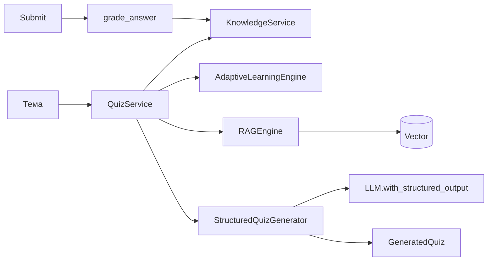

# Quiz Generation (AI Agri Academy)

Автоматично генериране на тестове по тема: **mastery → трудност → RAG контекст → structured LLM изход** чрез LangChain **`with_structured_output(GeneratedQuiz)`** (първо `method="json_mode"` при поддръжка, после default binding); при празен или невалиден резултат — **детерминистичен fallback** (`build_fallback_generated_quiz`). Изпращането на отговори обновява **`user_knowledge_state`** чрез `KnowledgeService` и `bump_mastery`.

## Архитектура

## Модули

| Път | Роля |
|-----|------|
| `app/models/quiz.py` | `QuizOption`, `QuizQuestion`, `GeneratedQuiz`, `QuizSubmitBody`, … |
| `ai/quiz/structured_generator.py` | `StructuredQuizGenerator` — prompt + `with_structured_output` + нормализация |
| `ai/quiz/generator.py` | `grade_answer`, `build_fallback_generated_quiz` |
| `ai/quiz/service.py` | `QuizService`, `get_quiz_service()` |
| `app/api/quiz_routes.py` | HTTP `/api/quiz/*` |
| `apps/web/src/components/academy/generated-quiz-viewer.tsx` | Визуализация на JSON от `/api/quiz/generate` |
| `apps/web/src/app/[locale]/academy/lab/quiz/page.tsx` | Демо страница (извиква Next proxy към backend) |

## API (изисква `FEATURE_TUTOR_ADAPTIVE` / `tutor.adaptive`)

| Метод | Път | Тяло |
|--------|-----|------|
| `POST` | `/api/quiz/generate` | `user_id`, `topic`, опционално `difficulty`, `num_questions`, `culture`, `region` |
| `POST` | `/api/quiz/submit` | `QuizSubmitBody`: `user_id`, `topic`, `questions` (същите като от generate), `answers`: `[{ "question_index": 0, "answer": "..." }]` |

**Submit:** клиентът връща **същия списък въпроси**, получен от `/generate`, заедно с отговорите по индекс (stateless). Оценката обновява mastery с **`bump_mastery`**.

## Бележки

- Схемата изисква **обяснение** за всеки въпрос; липсващ текст се попълва с безопасен placeholder при валидация.
- Трудност на въпрос: `beginner` \| `intermediate` \| `advanced` (стойността `expert` от адаптивния двигател се привежда към `advanced`).
- `estimated_time_minutes` се ограничава до **5–25** (и от модела, и при нормализация).
- Отговорът от `/generate` е `quiz.model_dump(mode="json")` (вкл. `generated_at` в ISO).
- Опционално: **`ACADEMY_QUIZ_USE_RAG_COMPRESSION=true`** — след retrieval контекстът минава през **`AgriContextualCompressor`** (виж `RAGEngine.aretrieve(..., use_compression=True)`).
- **`QUIZ_STRUCTURED_INVOKE_RETRIES`** (по подразбиране `2`, макс. 5) — при грешка на `ainvoke` или празен `questions`: кратък exponential backoff и повторен опит преди смяна на method/prompt.
- Промптът включва **few-shot** с примерна MCQ структура (по-стабилно попълване на полетата).